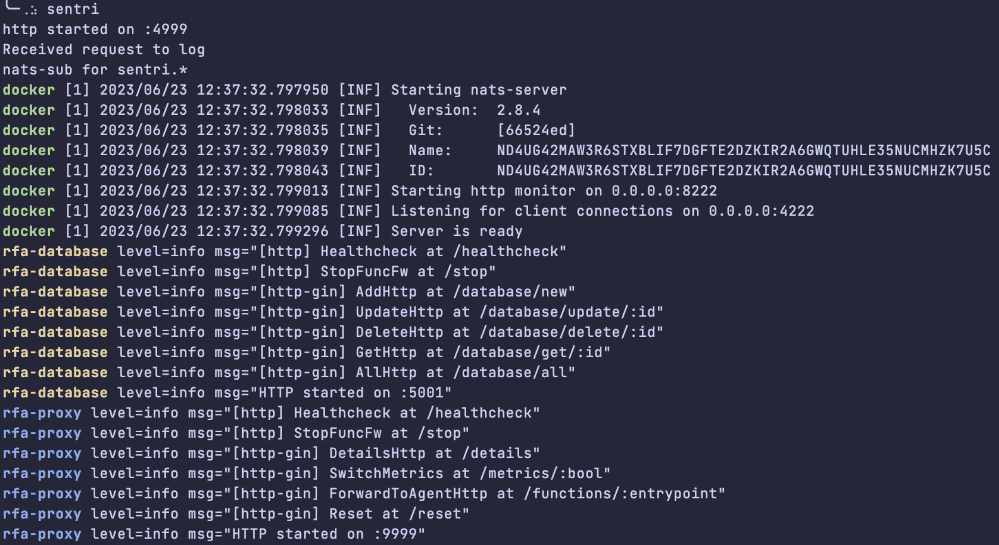
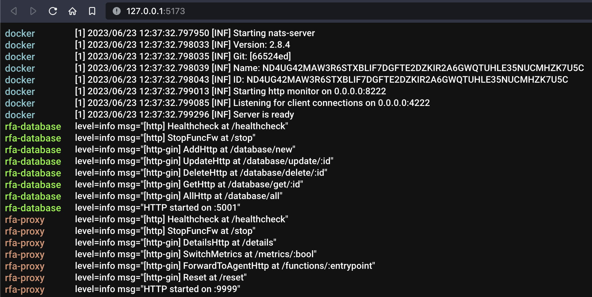

Pipe output from multiple commands and get a centralized docker-compose style view

#### pull nats
```shell
docker pull nats:alpine3.15
```

#### start sentri listener
```shell
sentri
```

#### start nats
```shell
docker run --name nats --rm -p 4222:4222 -p 8222:8222 nats:alpine3.15 --http_port 8222
# or better, hook with sentri
sentri docker run --name nats --rm -p 4222:4222 -p 8222:8222 nats:alpine3.15 --http_port 8222
```

#### hook some commands
```shell
sentri echo hi
sentri ls
sentri cat Readme.md

#sentri go run database/main.go
#sentri go run proxy/main.go
#sentri go run auth/main.go
#sentri go run cache/main.go
```

#### or, use as logrus hook
```go
package main

import "github.com/Ishan27g/sentri/hook"

func main(){

	w := hook.Hook("cmdName", os.Stdout)
	logrus.SetOutput(w)

}
```

#### example shell output


#### example ui output


